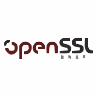
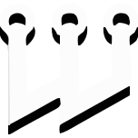

<!-- /phaedrusflow/phaedrusflow/README.md-->
<!-- Qompass AI Founder Github Profile-->
<!--Copyright (C) 2025 Qompass AI, All rights reserved-->
<!------------------------------------------------------>

<h2>Matt A. Porter</h2>

<h3>Former Intelligence Officer | Deep Tech Architect | Life-long Student</h3>

<h3>Helping you navigate the Deep Waters of Deep Tech with Quality AI Adoption Solutions</h3>

<!--  -->

  <a href="https://github.com/qompassai" target="_blank" style="text-decoration: none;">
    

      
      
    

  </a>

  
  
  
  

  

  <a href="https://next.ossinsight.io/widgets/official/compose-activity-trends?repo_id=41986369" target="_phaedrusflow">
    <picture>
      <source media="(prefers-color-scheme: dark)"
              srcset="https://next.ossinsight.io/widgets/official/compose-activity-trends/thumbnail.png?repo_id=41986369&image_size=auto&color_scheme=dark"
              width="815" height="auto">
      
    </picture>
  </a>

  <a href="https://next.ossinsight.io/widgets/official/compose-activity-trends?repo_id=41986369" target="_phaedrusflow">
    <picture>
      <source media="(prefers-color-scheme: dark)"
        srcset="https://next.ossinsight.io/widgets/official/compose-activity-trends/thumbnail.png?repo_id=41986369&image_size=auto&color_scheme=dark"
        width="815" height="auto">
      
    </picture>

  

    <h3 align="center">Front-End</h3>
    

      🔗 Click each icon to learn more
    

    

      

        
        
        
        
        
        
      

      

        
        
        
        
        
      

      

        
        
        
        
      

      

        
        
        
      

      

        
        
      

      

        
      

      <h3 align="center">DevOps</h3>
      

        🔗 Click each icon to learn more
      

      

        
      

      

        
        
      

      

        
        
        
      

      

        
        
        
        
      

      

        
        
        
        
        
      

      

        
        
        
        
        
        
      

      

        
        
        
        
        
        
        
      

      

        
        
        
        
        
        
        
      

      

        
        
        
        
        
        
        
        
        
      

***

<strong>🧭 About Me</strong>

<blockquote style="font-size: 1.2em; line-height: 1.8; padding: 25px; background: #f8f9fa; border-left: 6px solid #667eea; border-radius: 8px; margin: 15px 0; box-shadow: 0 2px 8px rgba(0,0,0,0.1);">

  
Matthew A. Porter 
  Former Intelligence Officer 
  Educator & Learner 
  DeepTech Founder & CEO

<h3>My Publications</h3>
  

    
    
    
  

<h3>My Developer Programs</h3>

<h3>My Professional Profiles</h3>
  

    
    
  

<h3>My Social Media</h3>
  

    
    
    
  

</blockquote>

<strong>🔥 How Do I Support</strong>

<blockquote style="font-size: 1.2em; line-height: 1.8; padding: 25px; background: #fff5f5; border-left: 6px solid #ff6b6b; border-radius: 8px; margin: 15px 0; box-shadow: 0 2px 8px rgba(0,0,0,0.1);">

<table>
<tr>
<th align="center">🏛️ Qompass AI Pre-Seed Funding 2023-2025</th>
<th align="center">🏆 Amount</th>
<th align="center">📅 Date</th>
</tr>
<tr>
<td><a href="https://github.com/qompassai/r4r" title="RJOS/Zimmer Biomet Research Grant Repository">RJOS/Zimmer Biomet Research Grant</a></td>
<td align="center">$30,000</td>
<td align="center">March 2024</td>
</tr>
<tr>
<td><a href="https://github.com/qompassai/PathFinders" title="GitHub Repository">Pathfinders Intern Program</a> 
<small><a href="https://www.linkedin.com/posts/evergreenbio_bioscience-internships-workforcedevelopment-activity-7253166461416812544-uWUM/" target="_blank">View on LinkedIn</a></small></td>
<td align="center">$2,000</td>
<td align="center">October 2024</td>
</tr>
</table>

 
<h4>🤝 How To Support Our Mission</h4>

<strong>🔐 Cryptocurrency Donations</strong>

**Monero (XMR):**

    <code>42HGspSFJQ4MjM5ZusAiKZj9JZWhfNgVraKb1eGCsHoC6QJqpo2ERCBZDhhKfByVjECernQ6KeZwFcnq8hVwTTnD8v4PzyH</code>
  

<button onclick="navigator.clipboard.writeText('42HGspSFJQ4MjM5ZusAiKZj9JZWhfNgVraKb1eGCsHoC6QJqpo2ERCBZDhhKfByVjECernQ6KeZwFcnq8hVwTTnD8v4PzyH')" style="padding: 6px 12px; background: #FF6600; color: white; border: none; border-radius: 4px; cursor: pointer;">
    📋 Copy Address
  </button>

<i>Funding helps us continue our research at the intersection of AI, healthcare, and education</i>

</blockquote>

  
<strong>Frequently Asked Questions</strong>

### Q: How do you mitigate against bias?

**TLDR - we do math to make AI ethically useful**

### A: We delineate between mathematical bias (MB) - a fundamental parameter in neural network equations - and algorithmic/social bias (ASB). While MB is optimized during model training through backpropagation, ASB requires careful consideration of data sources, model architecture, and deployment strategies. We implement attention mechanisms for improved input processing and use legal open-source data and secure web-search APIs to help mitigate ASB.

[AAMC AI Guidelines | One way to align AI against ASB](https://www.aamc.org/about-us/mission-areas/medical-education/principles-ai-use)

### AI Math at a glance

## Forward Propagation Algorithm

$$
y = w_1x_1 + w_2x_2 + ... + w_nx_n + b
$$

Where:

- $y$ represents the model output
- $(x_1, x_2, ..., x_n)$ are input features
- $(w_1, w_2, ..., w_n)$ are feature weights
- $b$ is the bias term

### Neural Network Activation

For neural networks, the bias term is incorporated before activation:

$$
z = \\sum\_{i=1}^{n} w_ix_i + b
$$
$$
a = \\sigma(z)
$$

Where:

- $z$ is the weighted sum plus bias
- $a$ is the activation output
- $\\sigma$ is the activation function

### Attention Mechanism- aka what makes the Transformer (The "T" in ChatGPT) powerful

- [Attention High level overview video](https://www.youtube.com/watch?v=fjJOgb-E41w)

- [Attention Is All You Need Arxiv Paper](https://arxiv.org/abs/1706.03762)

The Attention mechanism equation is:

$$
\\text{Attention}(Q, K, V) = \\text{softmax}\\left( \\frac{QK^T}{\\sqrt{d_k}} \\right) V
$$

Where:

- $Q$ represents the Query matrix
- $K$ represents the Key matrix
- $V$ represents the Value matrix
- $d_k$ is the dimension of the key vectors
- $\\text{softmax}(\\cdot)$ normalizes scores to sum to 1

### Q: Do I have to buy a Linux computer to use this? I don't have time for that!

### A: No. You can run Linux and/or the tools we share alongside your existing operating system:

- Windows users can use Windows Subsystem for Linux [WSL](https://learn.microsoft.com/en-us/windows/wsl/install)
- Mac users can use [Homebrew](https://brew.sh/)
- The code-base instructions were developed with both beginners and advanced users in mind.

### Q: Do you have to get a masters in AI?

### A: Not if you don't want to. To get competent enough to get past ChatGPT dependence at least, you just need a computer and a beginning's mindset. Huggingface is a good place to start.

- [Huggingface](https://docs.google.com/presentation/d/1IkzESdOwdmwvPxIELYJi8--K3EZ98_cL6c5ZcLKSyVg/edit#slide=id.p)

### Q: What makes a "small" AI model?

### A: AI models ~=10 billion(10B) parameters and below. For comparison, OpenAI's GPT4o contains approximately 200B parameters.

  
<strong>What a Dual-License Means</strong>

### Protection for Vulnerable Populations

The dual licensing aims to address the cybersecurity gap that disproportionately affects underserved populations. As highlighted by recent attacks<a href="#ref1">[1]</a>, low-income residents, seniors, and foreign language speakers face higher-than-average risks of being victims of cyberattacks. By offering both open-source and commercial licensing options, we encourage the development of cybersecurity solutions that can reach these vulnerable groups while also enabling sustainable development and support.

### Preventing Malicious Use

The AGPL-3.0 license ensures that any modifications to the software remain open source, preventing bad actors from creating closed-source variants that could be used for exploitation. This is especially crucial given the rising threats to vulnerable communities, including children in educational settings. The attack on Minneapolis Public Schools, which resulted in the leak of 300,000 files and a $1 million ransom demand, highlights the importance of transparency and security<a href="#ref8">[8]</a>.

### Addressing Cybersecurity in Critical Sectors

The commercial license option allows for tailored solutions in critical sectors such as healthcare, which has seen significant impacts from cyberattacks. For example, the recent Change Healthcare attack<a href="#ref4">[4]</a> affected millions of Americans and caused widespread disruption for hospitals and other providers. In January 2025, CISA<a href="#ref2">[2]</a> and FDA<a href="#ref3">[3]</a> jointly warned of critical backdoor vulnerabilities in Contec CMS8000 patient monitors, revealing how medical devices could be compromised for unauthorized remote access and patient data manipulation.

### Supporting Cybersecurity Awareness

The dual licensing model supports initiatives like the Cybersecurity and Infrastructure Security Agency (CISA) efforts to improve cybersecurity awareness<a href="#ref7">[7]</a> in "target rich" sectors, including K-12 education<a href="#ref5">[5]</a>. By allowing both open-source and commercial use, we aim to facilitate the development of tools that support these critical awareness and protection efforts.

### Bridging the Digital Divide

The unfortunate reality is that too many individuals and organizations have gone into a frenzy in every facet of our daily lives<a href="#ref6">[6]</a>. These unfortunate folks identify themselves with their talk of "10X" returns and building towards Artificial General Intelligence aka "AGI" while offering GPT wrappers. Our dual licensing approach aims to acknowledge this deeply concerning predatory paradigm with clear eyes while still operating to bring the best parts of the open-source community with our services and solutions.

### Recent Cybersecurity Attacks

Recent attacks underscore the importance of robust cybersecurity measures:

- The Change Healthcare cyberattack in February 2024 affected millions of Americans and caused significant disruption to healthcare providers.
- The White House and Congress jointly designated October 2024 as Cybersecurity Awareness Month. This designation comes with over 100 actions that align the Federal government and public/private sector partners are taking to help every man, woman, and child to safely navigate the age of AI.

By offering both open source and commercial licensing options, we strive to create a balance that promotes innovation and accessibility. We address the complex cybersecurity challenges faced by vulnerable populations and critical infrastructure sectors as the foundation of our solutions, not an afterthought.

### References

<strong>[1]</strong> <a href="https://www.whitehouse.gov/briefing-room/statements-releases/2024/10/02/international-counter-ransomware-initiative-2024-joint-statement/">International Counter Ransomware Initiative 2024 Joint Statement</a>

<strong>[2]</strong> <a href="https://www.cisa.gov/sites/default/files/2025-01/fact-sheet-contec-cms8000-contains-a-backdoor-508c.pdf">Contec CMS8000 Contains a Backdoor</a>

<strong>[3]</strong> <a href="https://www.aha.org/news/headline/2025-01-31-cisa-fda-warn-vulnerabilities-contec-patient-monitors">CISA, FDA warn of vulnerabilities in Contec patient monitors</a>

<strong>[4]</strong> <a href="https://www.chiefhealthcareexecutive.com/view/the-top-10-health-data-breaches-of-the-first-half-of-2024">The Top 10 Health Data Breaches of the First Half of 2024</a>

<strong>[5]</strong> <a href="https://www.cisa.gov/K12Cybersecurity">CISA's K-12 Cybersecurity Initiatives</a>

<strong>[6]</strong> <a href="https://www.ftc.gov/business-guidance/blog/2024/09/operation-ai-comply-continuing-crackdown-overpromises-ai-related-lies">Federal Trade Commission Operation AI Comply: continuing the crackdown on overpromises and AI-related lies</a>

<strong>[7]</strong> <a href="https://www.whitehouse.gov/briefing-room/presidential-actions/2024/09/30/a-proclamation-on-cybersecurity-awareness-month-2024/">A Proclamation on Cybersecurity Awareness Month, 2024</a>

<strong>[8]</strong> <a href="https://therecord.media/minneapolis-schools-say-data-breach-affected-100000/">Minneapolis school district says data breach affected more than 100,000 people</a>

