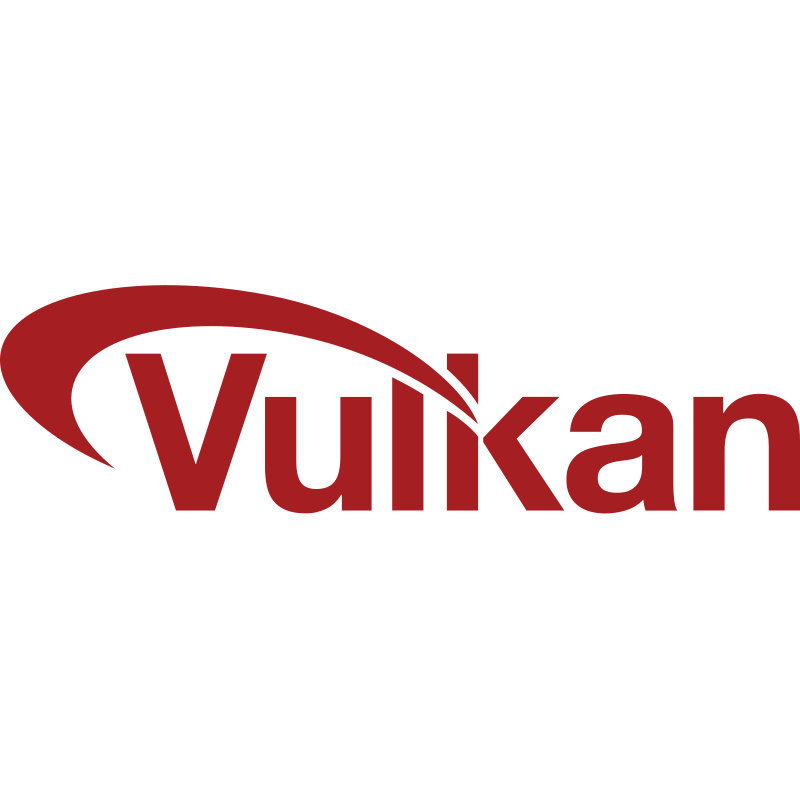

# Matt A. Porter

## Former Intelligence Officer | Qompass AI Founder/CEO

<h3>Helping you navigate the Deep Waters of Deep Tech with Quality AI Adoption Solutions</h3>

## Q: What defines AI "Quality"?

## A: Building safe, secure, and trustworthy systems supporting responsible innovation on-prem and on-device.

  
  

## Tech-Stack

<h2 align="center">My Tech Stack</h2>

### 🧠 Programming Languages

  

  
  
  
  
  
  

### 🌐 Web Development

       

### ⚙️ DevOps & Infra

##      

### 🗃️ Databases

##   

### 🛠️ Development Tools

##      

## Operating Systems

  

    
    

      
      
      
      
    

  

  
  

    
      
    

  

  

    
  

### Graphics & Media

  
  
  
  
  
  

### Edge Security

  
  
  
  
  
  

## Research Focus Areas

| Area                          | Description                                                    | Applications                                                                     |
| ----------------------------- | -------------------------------------------------------------- | -------------------------------------------------------------------------------- |
| **Quantum/AI Hybrid DevOps**  | Developing novel quantum algorithms for self-hosted deployment | Healthcare diagnostics, Personalized education, Network security                 |
| **Post-Quantum Cryptography** | Implementing quantum-resistant algorithms on-device            | Patient data protection, Educational records security, Government communications |
| **Quantum Error Correction**  | Optimizing search via quantum amplified search                 | Sustainably secure learning platforms with resilient cryptography                |

[📚 Read Full Research Details](#detailed-research)

## Connect With Me

<h3 align="center">Professional Networks</h3>

  

<h3 align="center">Social Media</h3>

  

<h3 align="center">Developer Programs</h3>

 

  
<strong>Research: The Pursuit of Quality Quantum Advantage</strong>

The foundation of quantum computing begins with the Schrödinger equation:

$$i\hbar\frac{\partial}{\partial t}\Psi(\mathbf{r},t) = \hat{H}\Psi(\mathbf{r},t)$$

**Schrodinger Legend:**

- $i$: imaginary unit
- $\hbar$: reduced Planck constant
- $\Psi(\mathbf{r},t)$: wavefunction at position $\mathbf{r}$ and time $t$
- $\hat{H}$: Hamiltonian operator

A qubit state forms the computational basis:

$|\psi\rangle = \alpha|0\rangle + \beta|1\rangle$ where $|\alpha|^2 + |\beta|^2 = 1$

**Qubit Legend:**

- $|\psi\rangle$: quantum state
- $\alpha, \beta$: complex probability amplitudes
- $|0\rangle, |1\rangle$: computational basis states
- $|\alpha|^2 + |\beta|^2 = 1$: normalization constraint

## Grover's Algorithm

**Quantum State Preparation:**

$$|\psi_0\rangle = \frac{1}{\sqrt{N}}\sum_{x=0}^{N-1}|x\rangle$$

**Grover Iteration (applied ~$\frac{\pi}{4}\sqrt{N}$ times):**

$$G = (2|\psi_0\rangle\langle\psi_0| - I) \cdot O_f$$

**Oracle Operation:**

$$
O_f|x\rangle = \begin{cases}
-|x\rangle & \text{if } f(x) = 1 \\
|x\rangle & \text{if } f(x) = 0
\end{cases}
$$

**Success Probability:**

$$P_{\text{success}} = \sin^2\left((2r+1)\arcsin\sqrt{\frac{M}{N}}\right)$$

**Grover's Legend:**

- $N = 2^n$: Size of search space (where n is number of qubits)
- $|\psi_0\rangle$: Uniform superposition of all basis states
- $O_f$: Oracle function marking solution states with phase flip
- $G$: Grover operator (one iteration)
- $M$: Number of solutions in the search space
- $r$: Number of Grover iterations performed
- $f(x)$: Function that returns 1 for solutions, 0 otherwise
- $I$: Identity operator

### Research Interests

#### 1. Quantum Machine Learning Algorithms

_Developing novel quantum algorithms to optimize on-device AI training and inference_

- **Medicine**: Equipping clinicians and learners to adopt quality AI tooling to support patient care
- **Education**: Personalizing learning paths via safe, secure, and trustworthy AI
- **Security**: Migration of IPV4 to IPV6 as it relates to network attack pattern detection

#### 2. Quantum-Resistant Cryptography Implementation

_Advancing the practical deployment of post-quantum algorithms in real-world systems._

- **Medicine**: Protecting patient data across multi-institution research networks
- **Education**: Securing student records and assessment platforms from future threats
- **Security**: Ensuring long-term confidentiality of sensitive government communications

#### 3. Quantum Error Correction

Improving quantum circuit reliability through advanced error mitigation techniques.

- **Medicine**: Enabling reliable quantum simulations for synthetic data generation
- **Education**: Securing computing platforms with post-quantum cryptography for student learning
- **Security**: Conducting FIPS 140-3 validation testing on cryptographic implementations to ensure compliance while preserving functionality during system degradation

# Post-Quantum Cryptography

## ML-KEM (Kyber)

ML-KEM operates in the polynomial ring $R_q = \mathbb{Z}_q[X]/(X^n + 1)$

**Key Generation:**

$$\text{pk} = (A, t = As + e)$$

**Encapsulation:**

$$c = (c_1 = A^T r + e_1, c_2 = t^T r + e_2 + \lfloor q/2 \rfloor m)$$

**Decapsulation:**

$$m' = \left\lceil\left(c_2 - s^T c_1\right) \cdot \frac{2}{q}\right\rceil$$

**ML-KEM Legend:**

- $R_q$: polynomial ring with coefficients in $\mathbb{Z}_q$
- $\mathbb{Z}_q$: integers modulo $q$
- $n$: polynomial degree (typically 256)
- $A$: public random matrix
- $s$: secret vector of small polynomials
- $e, e_1, e_2$: error vectors with small coefficients
- $r$: random vector used for encryption
- $m$: message bit (0 or 1)
- $m'$: recovered message bit
- $\text{pk}$: public key
- $t$: public key component
- $c, c_1, c_2$: ciphertext components
- $q$: modulus (typically 3329)

## ML-DSA (Dilithium)

**Key Generation:**

$$\text{pk} = (A, t = A s)$$

**Signature Generation:**

- Sample $y$ and compute $w = Ay$
- Compute challenge $c$ from message digest and $w$
- Compute $z = y + cs$
- Signature: $(z, h)$ where $h$ is a hint vector

**Verification:**
$$\|z\| < \gamma_1 \text{ and } \|Az - ct\| < \gamma_2$$

**ML-DSA Legend:**

- $A$: public random matrix
- $s$: secret key vector
- $\text{pk}$: public key
- $t$: public key component
- $y$: masking vector sampled during signing
- $w$: commitment value
- $c$: challenge hash
- $z$: response vector
- $h$: hint vector for verification
- $\gamma_1, \gamma_2$: bound parameters for verification
- $\|\cdot\|$: vector norm

## SLH-DSA (SPHINCS+)

**Hash-based Hypertree:**

- FORS few-time signature:
  $$\text{FORS-Sign}_{\text{SK}}(M) = (\text{sk}_1, \ldots, \text{sk}_k, \text{Auth}_1, \ldots, \text{Auth}_k)$$

- WOTS+ chain function:
  $$f^i(x) = F(f^{i-1}(x), i-1)$$

- Signature verification:
  $$\text{root} = \text{FORS-Verify}(M, \sigma_{\text{FORS}})$$

**SLH-DSA Legend:**

- FORS: Forest Of Random Subsets (few-time signature)
- WOTS+: Winternitz One-Time Signature+
- $\text{SK}$: secret key
- $M$: message
- $\text{sk}_1, \ldots, \text{sk}_k$: revealed secret key elements
- $\text{Auth}_1, \ldots, \text{Auth}_k$: authentication paths
- $f^i(x)$: hash chain function applied $i$ times
- $F$: cryptographic hash function
- $\sigma_{\text{FORS}}$: FORS signature component
- $\text{root}$: Merkle tree root for verification

## FN-DSA (Falcon)

**NTRU Equation:**
$$fG - gF = q \mod (X^N + 1)$$

**Key Generation:**

- Private key: small polynomials $(f, g, F, G)$
- Public key: $h = g/f \mod q$

**Signature Generation:**

- For message $m$ with hash $c$, find small $(s_1, s_2)$ such that:
  $$s_1 + s_2h = c \mod q$$

**Verification:**

- Check if $\|s\| < \beta$ and $s_1 + s_2h = c \mod q$

**FN-DSA Legend:**

- $f, g, F, G$: private key polynomials with small coefficients
- $q$: modulus
- $(X^N + 1)$: polynomial modulus (typically $N$ is a power of 2)
- $h$: public key polynomial
- $m$: message
- $c$: hash of message mapped to a polynomial
- $s_1, s_2$: signature polynomials
- $s$: combined signature vector $(s_1, s_2)$
- $\beta$: signature norm bound
- $\|s\|$: Euclidean norm of signature

## Hybrid Key Establishment

If $Z$ is a classical shared secret (e.g., from ECDH) and $T$ is a post-quantum shared secret:

$$Z' = Z \parallel T$$

The final key is derived using a key derivation function:

$$K = \text{KDF}(Z')$$

**Hybrid Key Legend:**

- $Z$: shared secret from classical algorithm (e.g., ECDH)
- $T$: shared secret from post-quantum algorithm (e.g., ML-KEM)
- $\parallel$: concatenation operation
- $Z'$: combined shared secret
- $\text{KDF}$: Key Derivation Function
- $K$: final derived key material

